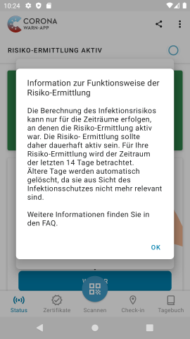
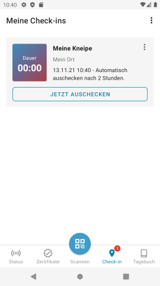
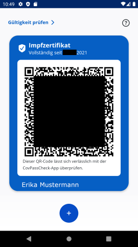

# Corona-Warn-App (CWA)
Inspiriert durch Henning Tillmann (https://twitter.com/henningtillmann/status/1459127327439396867) ist diese Anleitung entstanden. Sie soll allen, die Veranstaltungen abhalten möchten oder Restaurants betreiben oder aus anderen Gründen mit der Corona-Warn-App (https://www.bundesregierung.de/breg-de/themen/corona-warn-app) zu tun haben, eine Orientierungshilfe sein. Da ich selber nur Android nutze, sind die technischen Details hier androidlastig.

## Grundsätzliche Funktionsweise
### Automatische Erfassung von Kontakten
Die CWA nutzt so wenige Daten wie möglich, um Kontakte nachzuverfolgen. Jedes Gerät, das die CWA installiert hat, sendet in regelmäßigen Abständen eine zufällige ID. Andere Geräte in der Umgebung empfangen diese. Dabei werden [bitte prüfen] die Uhrzeit und die Signalstärke gespeichert - mehr nicht, insbesondere kein Ort. Aus diesen Daten wird ungefähr errechnet, wie lange und wie nah die Geräte beieinander waren.

Im Falle eines positiven PCR-Tests kann in der CWA ein Code eingegeben werden, der dann eine Warnung auf Geräten, die meinem Gerät nahe waren, auslöst. [sehr nebuloes, ueberarbeiten]

Damit dies zuverlässig funktioniert, muß in Android die Akku-Optimierung deaktiviert werden - sonst kann es sein, daß die App vom Betriebssystem geschlossen wird (Vorgehen siehe Installation)

### Zertifikatsspeicher
Tests und Impfzertifikate können in der CWA gespeichert werden, damit keine Papiere herumgetragen werden müssen.

## Installation
Die Installation der Apps läuft wie gewohnt ueber den PlayStore bzw. AppStore. Am Ende habt ihr die gewünschten Apps installiert: 

Nach dem ersten Start der CWA kommen eine Reihe von Erklärungen. Lest diese bitte einmalig. Am Ende kommt die Frage, ob Benachrichtingungen aktiviert werden sollen:

Ich empfehle, diese Erlaubnis zu erteilen.

Im weiteren Verlauf der Ersteinrichtung kommt eine Frage nach der Datenspende:

Hier könnt ihr selber entscheiden.

Es folgen 2 Warnungen, daß die App dauerhaft aktiv sein muß, um korrekt zu funktionieren. Unter Android müßt ihr dafür die CWA von der Akku-Optimierung ausnehmen:

Dafür klickt ihr hier auf ERLAUBEN:

Als nächstes wird die Akkuoptimierung angezeigt, leider zuerst nur für die Apps, die bereits von der Optimierung ausgenommen sind. Ihr müßt also oben auf "nicht optimiert" klicken, dort "Alle Apps" auswählen. Dann könnt ihr nach "Corona" suchen, darauf tippen und die Akku-Optimierung deaktivieren:

Damit ist die grundlegende Einrichtung der App abgeschlossen.

## Zertifikate hinzufügen
Wenn ihr "Zertifikate" antippt, seht ihr, daß noch keine Zertifikate hinzugefügt wurden. Um dies zu tun, tippt "Scannen" an und scannt ein Impf- oder Testzertifikat. Dieses wird dann in der App angezeigt:

Tippt ihr auf das Zertifikat, wird es größer angezeigt, falls es Probleme beim Scannen geben sollte.
Tippt ihr oben rechts auf die 3 Punkte, könnt ihr das Zertifikat wieder löschen.

Besteht bitte darauf, daß euer Zertifikat korrekt mit der CovPass-Check-App getestet wird und mit eurem Personalausweis abgeglichen wird.

### Zertifikate mehrerer Personen
Ihr könnt problemfrei für mehrere Leute die Zertifikate einscannen. Es kann dann eingestellt werden, welches Zertifikat als oberstes angezeigt werden soll.

### Gültigkeit prüfen
Die Schaltfläche "Gültigkeit prüfen" unterstützt euch, die Gültigkeit des Zertifikats in anderen Ländern zu überprüfen. Wählt hier aus, wann ihr in welches Land fahren wollt und tippt "prüfen" an.

## Erstellung von Veranstaltungs- oder Lokationscodes
In der CWA können für einzelne Events und für feste Lokationen QR-Codes generiert werden, mit denen Gäste einchecken können. Dies hat zur Folge, daß ein anderer Gast, der ebenfalls zur fraglichen Zeit eingecheckt war, eine Warnung auf seinem Endgerät erhält, selbst wenn das automatische Erfassen der Geräte via Bluetooth nicht funktioniert hat.

Um einen QR-Code zu erstellen, scrollt auf der Startseite nach unten und tippt auf "QR-Code erstellen":

Lest hier die Hinweise am Start einmalig durch.

Anfangs habt ihr keine Codes, also tippt auf die Schaltfläche "+ QR-Code". Wählt dann aus, was für einen Code ihr erstellen wollt - Eventcodes sind zeitlich begrenzt, Codes für Orte sind unbegrenzt:

Gebt im Folgebildschirm die Details der Veranstaltung ein:

Der QR-Code ist dann auf eurem Gerät gespeichert:

Tippt ihr den Eintrag an, öffnet sich der QR-Code. Mittels "Druckversion anzeigen" könnt ihr eine PDF-Datei erstellen, die ihr ausdrucken und aufhängen könnt.

[Frage an die Experten: wenn ich einen Code erstelle, lösche und dann mit denselben Daten wieder neu erstelle, sind die Codes dann identisch? Nutzungsfall beispielsweise: ich hatte den QR-Code für meine Kneipe nur auf dem Handy gespeichert, das aber defekt ist. Jetzt möchte ich den Code neu ausdrucken.]

## Einchecken
Eincheck geht durch einfaches Scannen des QR-Codes. Es öffnet sich dieses Bild:

Unter "Check-in" ist dann ein Eintrag zu finden, wo ihr euch wieder auschecken könnt:

Leider ist es aktuell so, daß man ein automatisches Auschecken nicht verlängern kann.
 

## Tagebuch
t.b.d.

# CovPass
Die CovPass-App bietet die Möglichkeit, Test- und Impfzertifikate zu verwalten, ohne die erweiterten Funktionen der CWA zu bieten (Bluetooth-Messung, Tagebuch, ...). Nach dem ersten Start kommen verschiedene Hinweistexte, die ihr bitte einmalig lest. Danach wird gezeigt, daß ihr keine Zertifikate installiert habt. Um dies zu ändern tippt auf das Plus:

Falls ihr keinen Sperrcode auf dem Telefon habt, werdet ihr jetzt daran erinnert, einen einzurichten, damit die Daten aus der App vor Unbefugten geschützt werden. Einmalig müßt ihr den Kamerazugriff erlauben. Wenn ihr dann ein Zertifikat einscannt, werden sofort die Details des Zertifikats angezeigt:

Geht ihr zurück, gibt es die Übersicht aller Zertifikate. Auch in dieser App können Zertifikate mehrerer Personen verwendet werden:

  

# CovPassCheck
Die CovPass-Check-App wird benötigt, um die Gültigkeit von Zertifikaten zuverlässig zu überprüfen. Auch hier werdet ihr von einer Anleitung begrüßt, die ausnahmsweise hier komplett wiedergegeben wird:

Die CovPass-Check-App kann auch ohne aktive Internetverbindung genutzt werden, muß dann aber regelmäßig mit dem Internet verbunden werden, um aktuelle Zertifikatsdaten herunterzuladen. Dies wird unten in der App angezeigt:

Durch Antippen von "Zertifikat scannen" gelangt ihr in den Modus, mit dem ihr Zertifikate überprüfen könnt. Einmalig muß der Kamerazugriff genehmigt werden.

Scannt damit ein Zertifikat. Dann werden euch Daten angezeigt, **die ihr mit einem Ausweisdokument abgleichen müßt**!

# Sonstiges

## Android-Version
Die Screenshots und die Anleitung stammen aus einem emulierten Android 11. In aelteren Android-Versionen ist das Vorgehen mit der Akku-Optimierung eventuell anders. Bitte ergaenzt das gerne in dieser Anleitung. Auch, wenn das in iOS anders geht, ergaenzt das gerne.

## Darstellung dieser Anleitung
Ich haette gerne eine Moeglichkeit, je nach genutzem Betriebssystem direkt die korrekte Anleitung anzeigen zu lassen. Wer hier Ideen hat, darf gerne auf mich zukommen (@jesterchen42 auf Twitter). Auch, wer helfen kann, die Darstellung so zu verbessern, daß am Ende nicht ein viel zu langes Dokument herauskommt, ist herzlich willkommen.
... vermutlich wären kurze Videos hier deutlich sinnvoller. Die kann ich aber nicht.

## Rechtliches
Dieser Text sowie die Screenshots können frei verwendet werden, ohne Namensnennung, ohne Verlinkung. Ich würde mich natürlich freuen, wenn hier viele Leute mitarbeiten und am Ende ein einzelnes Dokument herauskommt, das den Leuten hilft. Und natürlich übernehme ich keinerlei Verantwortung für Datenschutz- oder Infektionsvorfälle.